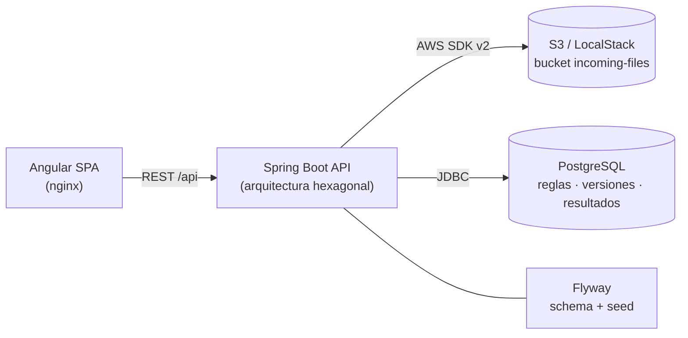
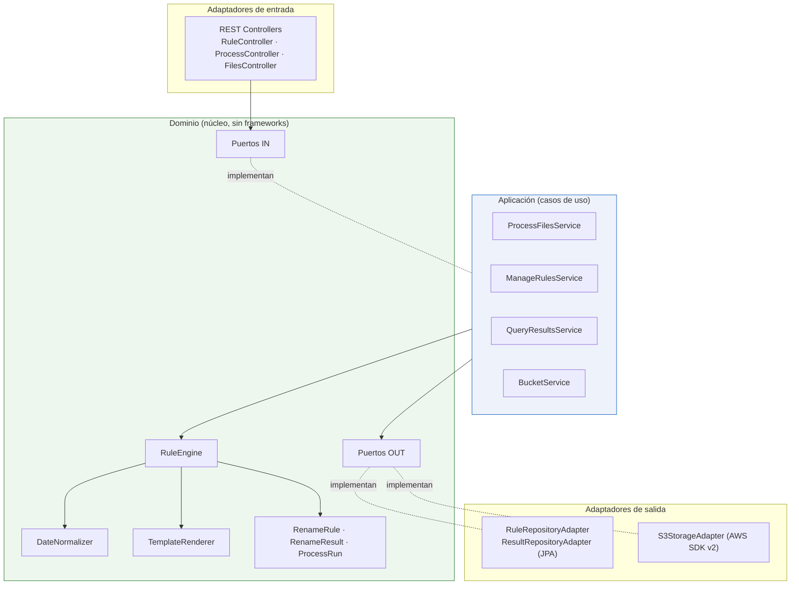
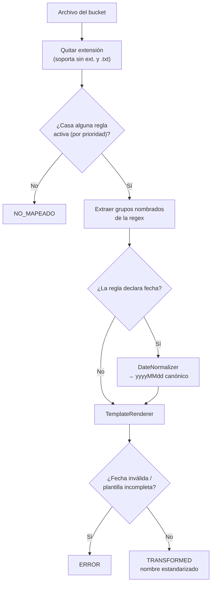

# Arquitectura — Renombramiento Inteligente de Archivos en S3

## Vista de componentes (cloud / despliegue)

## Arquitectura hexagonal (Ports & Adapters) del backend

**Regla de dependencia** (verificada con ArchUnit en `HexagonalArchitectureTest`):
- `domain` no depende de Spring, AWS, JPA ni de `application`/`adapter`/`config`.
- `application` depende solo del `domain` (puertos), no de adaptadores ni de Spring.
- El cableado vive en `config.BeanConfiguration` (composition root).

## Flujo de transformación (motor de reglas)

## Modelo de datos (PostgreSQL)

- `rename_rule` — estado vigente de cada regla.
- `rename_rule_version` — snapshot inmutable por cada cambio (historial/auditoría).
- `ruleset_version` — contador global del catálogo (trazabilidad de reprocesos).
- `process_run` — ejecución (timestamp + versión de catálogo usada).
- `rename_result` — detalle por archivo (estado, regla aplicada, mensaje).
